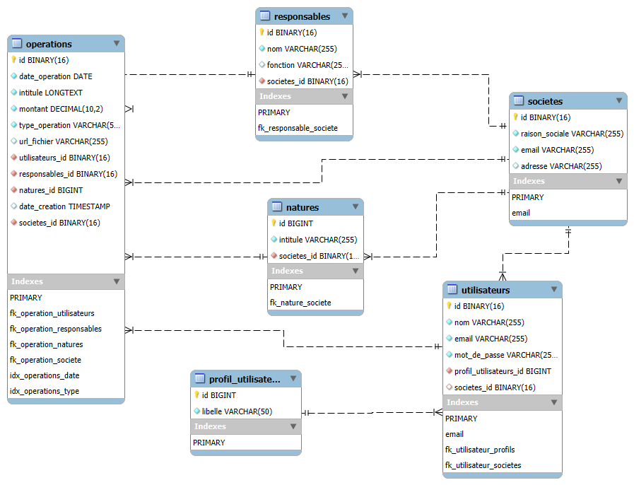

# 💸 Kobbo - Gestion des dépenses et recettes

Kobbo est un projet **open source** permettant aux **particuliers** et les **petites et moyennes entreprises  (PME)** de
suivre facilement leurs **dépenses** et **recettes**.

L'objectif principal est de fournir une plateforme simple et efficace pour une meilleure visibilité financière.

---

## 🧩 Fonctionnalités principales

- Création et gestion de plusieurs sociétés
- Gestion des utilisateurs avec rôles (profils)
- Enregistrement des opérations (dépenses/recettes)
- Catégorisation des opérations par nature (salaire, loyer, etc.)
- Association des opérations à des responsables réels
- Filtres puissants par date, type, société, etc.

---

## 🧱 Modèle de données relationnel

L'application repose sur une base de données MySQL structurée comme suit :

### Tables et relations :

- **`societes`** : entités principales (PME, particuliers)
- **`profil_utilisateurs`** : rôles des utilisateurs
- **`utilisateurs`** : personnes utilisant la plateforme
- **`natures`** : types d'opérations financières (ex : Salaire)
- **`responsables`** : personnes physiques responsables d'une opération
- **`operations`** : enregistrement des transactions financières

📊 Un diagramme UML est fourni pour visualiser les relations entre les entités :



---

## ⚙️ Technologies utilisées

- **Langage** : SQL / Java / Spring Boot (recommandé)
- **Base de données** : MySQL / MariaDB
- **Sécurité** : UUID, contraintes d'intégrité, authentification (JWT) basée sur rôles
- **Frontend** : Libre choix (Angular, React, etc.)

---

## 🚀 Installation

### 🔧 Prérequis

- Java 17+
- MySQL 8+
- Maven / Gradle
- (Optionnel) Docker & Docker Compose

### 📥 Étapes

1. Clonez le projet :

```bash
git clone https://github.com/votre-utilisateur/kobbo.git
cd kobbo
```

### 🤝 Contribution

Les contributions sont les bienvenues !

Forkez le projet

Créez une branche (feature/ma-fonctionnalite)

Commitez vos modifications (git commit -am 'Ajout nouvelle fonctionnalité')

Pushez (git push origin feature/ma-fonctionnalite)

Ouvrez une Pull Request

### 👨‍💻 Auteur

Développé avec ❤️ par Corneille GBEAGA.
Contact : cgbeaga@gmail.com

---

# 📋 Endpoints REST - Kobbo API

---

## 🔐 Authentification & Autorisation

### Authentification

* **POST** `/api/auth/login` - Connexion utilisateur
* **POST** `/api/auth/logout` - Déconnexion utilisateur
* **POST** `/api/auth/refresh` - Actualiser le token JWT
* **POST** `/api/auth/forgot-password` - Demande de réinitialisation mot de passe
* **POST** `/api/auth/reset-password` - Réinitialisation mot de passe

### Gestion des utilisateurs

* **GET** `/api/users` - Lister tous les utilisateurs (**Admin**)
* **GET** `/api/users/{id}` - Récupérer un utilisateur par ID
* **POST** `/api/users` - Créer un nouvel utilisateur
* **PUT** `/api/users/{id}` - Modifier un utilisateur
* **DELETE** `/api/users/{id}` - Supprimer un utilisateur
* **GET** `/api/users/me` - Récupérer le profil de l'utilisateur connecté
* **PUT** `/api/users/me` - Modifier le profil de l'utilisateur connecté
* **PUT** `/api/users/me/password` - Changer le mot de passe

---

## 🏢 Gestion des Sociétés

### CRUD Sociétés

* **GET** `/api/societes` - Lister toutes les sociétés accessibles
* **GET** `/api/societes/{id}` - Récupérer une société par ID
* **POST** `/api/societes` - Créer une nouvelle société
* **PUT** `/api/societes/{id}` - Modifier une société
* **DELETE** `/api/societes/{id}` - Supprimer une société

### Gestion des utilisateurs dans une société

* **GET** `/api/societes/{id}/users` - Lister les utilisateurs d'une société
* **POST** `/api/societes/{id}/users` - Ajouter un utilisateur à une société
* **PUT** `/api/societes/{societeId}/users/{userId}` - Modifier le rôle d'un utilisateur
* **DELETE** `/api/societes/{societeId}/users/{userId}` - Retirer un utilisateur d'une société

---

## 👥 Gestion des Profils Utilisateurs

### CRUD Profils

* **GET** `/api/profils` - Lister tous les profils disponibles
* **GET** `/api/profils/{id}` - Récupérer un profil par ID
* **POST** `/api/profils` - Créer un nouveau profil (**Admin**)
* **PUT** `/api/profils/{id}` - Modifier un profil (**Admin**)
* **DELETE** `/api/profils/{id}` - Supprimer un profil (**Admin**)

---

## 🏷️ Gestion des Natures d'Opérations

### CRUD Natures

* **GET** `/api/natures` - Lister toutes les natures d'opérations
* **GET** `/api/natures/{id}` - Récupérer une nature par ID
* **POST** `/api/natures` - Créer une nouvelle nature
* **PUT** `/api/natures/{id}` - Modifier une nature
* **DELETE** `/api/natures/{id}` - Supprimer une nature

### Natures par société

* **GET** `/api/societes/{societeId}/natures` - Lister les natures d'une société
* **POST** `/api/societes/{societeId}/natures` - Créer une nature pour une société

---

## 👤 Gestion des Responsables

### CRUD Responsables

* **GET** `/api/responsables` - Lister tous les responsables
* **GET** `/api/responsables/{id}` - Récupérer un tiers par ID
* **POST** `/api/responsables` - Créer un nouveau tiers
* **PUT** `/api/responsables/{id}` - Modifier un tiers
* **DELETE** `/api/responsables/{id}` - Supprimer un tiers

### Responsables par société

* **GET** `/api/societes/{societeId}/responsables` - Lister les responsables d'une société
* **POST** `/api/societes/{societeId}/responsables` - Créer un tiers pour une société

---

## 💰 Gestion des Opérations (Cœur métier)

### CRUD Opérations

* **GET** `/api/operations` - Lister toutes les opérations (avec filtres)
* **GET** `/api/operations/{id}` - Récupérer une opération par ID
* **POST** `/api/operations` - Créer une nouvelle opération
* **PUT** `/api/operations/{id}` - Modifier une opération
* **DELETE** `/api/operations/{id}` - Supprimer une opération

### Opérations par société

* **GET** `/api/societes/{societeId}/operations` - Lister les opérations d'une société
* **POST** `/api/societes/{societeId}/operations` - Créer une opération pour une société

### Filtres et recherches avancées

* **GET** `/api/operations/search` - Recherche avec filtres complexes
    * Paramètres : `societeId`, `typeOperation`, `dateDebut`, `dateFin`, `responsableId`, `natureId`, `montantMin`,
      `montantMax`
* **GET** `/api/operations/by-periode` - Opérations par période
    * Paramètres : `societeId`, `debut`, `fin`, `groupBy` (jour/semaine/mois)
* **GET** `/api/operations/by-nature` - Opérations groupées par nature
* **GET** `/api/operations/by-tiers` - Opérations groupées par tiers
* **GET** `/api/operations/by-type` - Opérations groupées par type (dépense/recette)

---

## 📊 Endpoints de Statistiques et Rapports

### Statistiques générales

* **GET** `/api/stats/dashboard` - Données du tableau de bord
* **GET** `/api/stats/societe/{id}/resume` - Résumé financier d'une société
* **GET** `/api/stats/societe/{id}/evolution` - Évolution des finances dans le temps

### Rapports par période

* **GET** `/api/reports/societe/{id}/mensuel` - Rapport mensuel
* **GET** `/api/reports/societe/{id}/annuel` - Rapport annuel
* **GET** `/api/reports/societe/{id}/custom` - Rapport personnalisé (dates libres)

### Statistiques par catégorie

* **GET** `/api/stats/societe/{id}/depenses-par-nature` - Répartition des dépenses par nature
* **GET** `/api/stats/societe/{id}/recettes-par-nature` - Répartition des recettes par nature
* **GET** `/api/stats/societe/{id}/balance` - Balance recettes/dépenses

### Comparaisons et tendances

* **GET** `/api/stats/societe/{id}/comparaison-mensuelle` - Comparaison mois par mois
* **GET** `/api/stats/societe/{id}/tendances` - Analyse des tendances
* **GET** `/api/stats/societe/{id}/previsions` - Prévisions basées sur l'historique

---

## 📁 Gestion des Fichiers et Exports

### Exports

* **GET** `/api/exports/operations/csv` - Export des opérations en CSV
* **GET** `/api/exports/operations/excel` - Export des opérations en Excel
* **GET** `/api/exports/operations/pdf` - Export des opérations en PDF

### Imports

* **POST** `/api/imports/operations/csv` - Import d'opérations depuis CSV
* **POST** `/api/imports/operations/excel` - Import d'opérations depuis Excel

### Justificatifs

* **POST** `/api/operations/{id}/fichiers` - Ajouter un fichier à une opération
* **GET** `/api/operations/{id}/fichiers` - Lister les fichiers d'une opération
* **DELETE** `/api/operations/{operationId}/fichiers/{fichierId}` - Supprimer un fichier

---

## 🔧 Endpoints d'Administration

### Gestion système

* **GET** `/api/admin/system/health` - État de santé du système
* **GET** `/api/admin/system/metrics` - Métriques système
* **GET** `/api/admin/system/logs` - Logs système (**Admin** uniquement)

### Gestion des données

* **POST** `/api/admin/backup` - Créer une sauvegarde
* **POST** `/api/admin/restore` - Restaurer une sauvegarde
* **DELETE** `/api/admin/cleanup` - Nettoyer les données obsolètes

### Paramètres globaux

* **GET** `/api/admin/settings` - Récupérer les paramètres globaux
* **PUT** `/api/admin/settings` - Modifier les paramètres globaux

---

## 🎯 Endpoints Utilitaires

### Validation et vérification

* **POST** `/api/utils/validate-email` - Valider un email
* **GET** `/api/utils/check-societe-name` - Vérifier la disponibilité d'un nom de société
* **GET** `/api/utils/currencies` - Lister les devises supportées

### Recherche globale

* **GET** `/api/search` - Recherche globale dans l'application
* **GET** `/api/search/operations` - Recherche spécifique aux opérations
* **GET** `/api/search/responsables` - Recherche spécifique aux responsables

### Notifications

* **GET** `/api/notifications` - Lister les notifications de l'utilisateur
* **PUT** `/api/notifications/{id}/read` - Marquer une notification comme lue
* **DELETE** `/api/notifications/{id}` - Supprimer une notification

---

## 📋 Paramètres de requête communs

### Pagination

* `page` : Numéro de page (défaut : 0)
* `size` : Taille de page (défaut : 20)
* `sort` : Critère de tri (ex: `date,desc`)

### Filtres généraux

* `search` : Recherche textuelle
* `active` : Filtrer les éléments actifs/inactifs
* `dateDebut` : Date de début (format ISO)
* `dateFin` : Date de fin (format ISO)

### Formats de réponse

* `format` : Format de réponse (json, csv, excel, pdf)
* `lang` : Langue de la réponse (fr, en)

---

## 🔒 Niveaux d'autorisation requis

### Rôles suggérés

* **ADMIN** : Accès complet à toutes les fonctionnalités
* **MANAGER** : Gestion d'une société et de ses utilisateurs
* **COMPTABLE** : Gestion des opérations financières
* **UTILISATEUR** : Consultation et saisie limitée
* **LECTEUR** : Consultation seule

### Matrice des permissions

* Les endpoints d'administration nécessitent le rôle **ADMIN**
* Les endpoints de gestion de société nécessitent **MANAGER** ou **ADMIN**
* Les endpoints de saisie d'opérations nécessitent **COMPTABLE** ou supérieur
* Les endpoints de consultation nécessitent **UTILISATEUR** ou supérieur

---

## 📝 Notes d'implémentation

### Sécurité

* Tous les endpoints nécessitent une authentification JWT sauf `/api/auth/login`
* Validation des permissions basée sur les rôles et l'appartenance aux sociétés
* Utilisation d'UUID pour tous les identifiants

### Performance

* Implémentation de la pagination sur tous les endpoints de listing
* Cache Redis recommandé pour les statistiques fréquemment consultées
* Indexation des champs de recherche en base de données

### Versioning

* Préfixe `/api/v1` recommandé pour le versioning
* Headers `Accept` et `Content-Type` obligatoires
* Support du format JSON par défaut