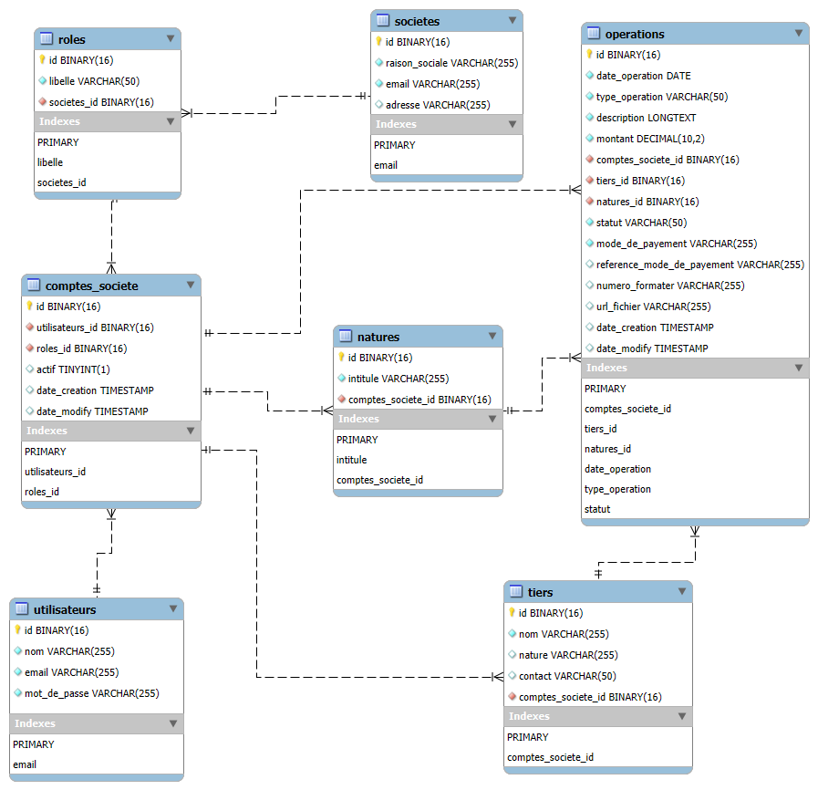
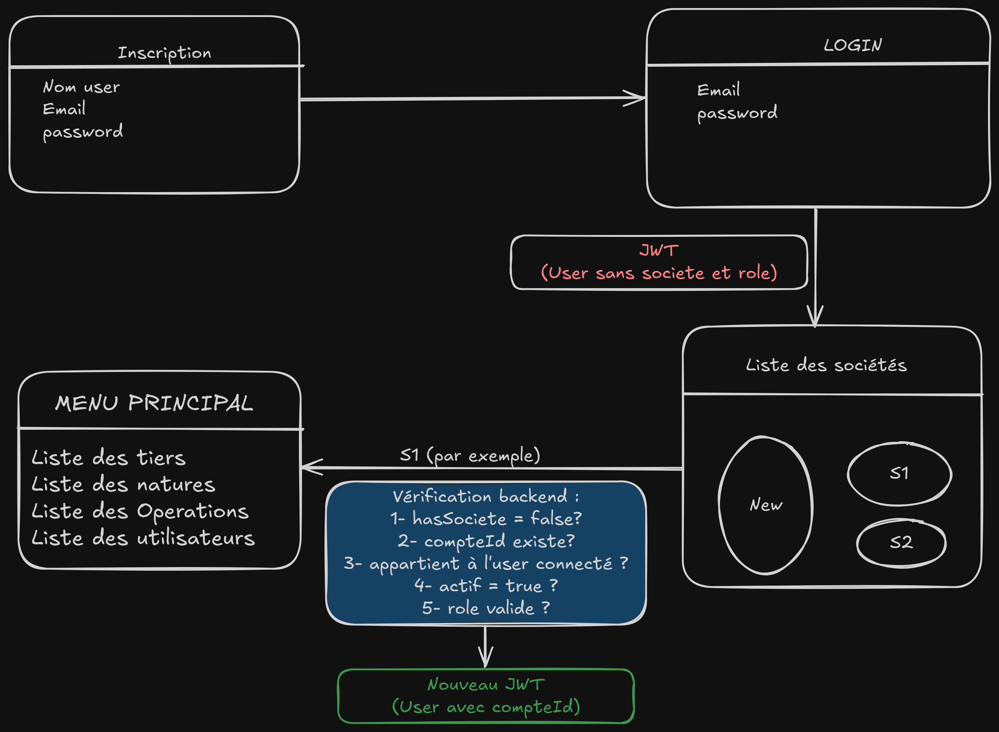

# 💰 Kobbo - Gestion des Dépenses et Recettes Multi-Sociétés

Kobbo est une application de gestion des finances personnelles et professionnelles permettant à
un utilisateur de gérer ses dépenses et recettes dans plusieurs sociétés à partir d’un seul compte.

---

## 📌 Fonctionnalités principales

- Gestion multi-sociétés avec isolation logique des données
- Un utilisateur unique peut avoir plusieurs comptes dans différentes sociétés
- Définition de rôles personnalisés par société
- Suivi des opérations (dépenses / recettes)
- Catégorisation des opérations par nature
- Gestion des tiers (clients, fournisseurs, etc.)
- Pièces justificatives (upload de fichiers via URL)

---

## 🧱 Modèle de données relationnel

L'application repose sur une base de données MySQL structurée comme suit :

### Tables et relations :

- **`societes`** : Entités indépendantes représentant des entreprises.
- **`utilisateurs`** : Comptes d'accès individuels, uniques et globaux.
- **`roles`** : Définis par chaque société, utilisés pour les autorisations.
- **`comptes_societe`** : Lien entre utilisateur, rôle et société.
- **`tiers`** : Clients, fournisseurs, ou autres entités externes associées à des opérations.
- **`natures`** : Catégories d'opérations personnalisables par utilisateur-société.
- **`operations`** : Représentent les transactions financières (recettes ou dépenses).

📊 Un diagramme UML est fourni pour visualiser les relations entre les entités :



---

## ⚙️ Technologies utilisées

- **Langage** : SQL / Java / Spring Boot
- **Base de données** : MySQL
- **Sécurité** : UUID, contraintes d'intégrité, authentification (JWT)
- **Frontend** : Libre choix (Angular, React, etc.)

---

## 📝 Processus de création de compte et d’authentification

La création de compte sur la plateforme suit un processus bien défini garantissant la cohérence des données en base et
une expérience utilisateur fluide.

### 🧾 Création de compte

L'utilisateur crée un compte personnel en remplissant un formulaire avec les champs suivants :

- Nom
- Email
- Mot de passe

Une fois le compte créé, il est redirigé vers la page de connexion.

### 🏢 Connexion, sélection de la société et navigation

1️⃣ Connexion initiale :

L’utilisateur s’authentifie avec email + mot de passe.

    Backend génère un JWT simple de courte durée (5 min par exemple) :
    
    hasSociete = false
    
    Pas de compteId
    
    Ce token ne permet que d’appeler /comptes/select.

Après connexion (via email + mot de passe), l'utilisateur accède à une nouvelle page listant ses sociétés (le cas
échéant).

S’il n’en a aucune, un bouton **"Créer une société"** lui est proposé.

Lors de la création d’une société, les éléments suivants sont générés :

- Enregistrement de la société (`societes`)
- Création automatique du rôle `PROPRIETAIRE`
- Affectation de l’utilisateur courant à cette société avec le rôle `PROPRIETATIRE` (`comptes_societe`)

2️⃣ Sélection de société :

L’utilisateur choisit une société → appel à `/comptes/select` avec le 1er token.

    Backend vérifie :
    
    Que la société appartient à l’utilisateur.
    
    Que hasSociete est bien false.
    
    Génère un nouveau JWT enrichi (plus longue durée, ex : 24h) :
    
    hasSociete = true
    
    Contient compteId.

3️⃣ Requêtes métier :

Un filtre Spring Security bloque toute requête qui n’a pas hasSociete = true.

Les endpoints sensibles n’ont donc jamais accès à un token “incomplet”.

L'utilisateur sélectionne une société pour définir le contexte d’exécution.

Une fois la société choisie, le menu principal est affiché, donnant accès aux différentes fonctionnalités (gestion des
utilisateurs, rôles, opérations, natures, etc.).



### 🔐 Authentification

Tous les endpoints (sauf [POST] /api/v1/kobbo/utilisateurs et [POST] /api/v1/kobbo/auth/login) nécessitent un JWT valide
dans l’en-tête Authorization.

    Authorization: Bearer <token>

### 🆕 Ajout de logique lors de la création de société

Quand un utilisateur authentifié appelle :

    POST /api/societes

Le backend effectue les actions suivantes (transaction atomique) :

1- Crée la société

2- Crée automatiquement un rôle par défaut PROPRIETAIRE (si non existant)

3- Crée une entrée dans comptes_societe liant l’utilisateur, la société et le rôle PROPRIETAIRE

#### 📌 Exemple JSON - Création société

Requête :

    POST /api/societes
    Authorization: Bearer <jwt>

    {
        "nom": "Kobbo SARL",
        "description": "Société de test"
    }

Réponse :

    {
        "id": "uuid-societe",
        "nom": "Kobbo SARL",
        "admin": {
            "idUtilisateur": "uuid-user",
            "role": "PROPRIETAIRE"
        }
    }

# 📋 Endpoints REST - Kobbo API

| Méthode | Endpoint                                   | Description                                  |
|---------|--------------------------------------------|----------------------------------------------|
| POST    | `/api/v1/kobbo/utilisateurs`               | Créer un compte utilisateur                  |
| POST    | `/api/v1/kobbo/auth/login`                 | Connexion utilisateur, renvoie un JWT        |
| GET     | `/api/v1/kobbo/societes`                   | Lister les sociétés d’un utilisateur         |
| POST    | `/api/v1/kobbo/societes`                   | Créer une société                            |
| GET     | `/api/v1/kobbo/societes/{id}/utilisateurs` | Liste des utilisateurs d’une société         |
| POST    | `/api/v1/kobbo/societes/{id}/utilisateurs` | Ajouter un utilisateur à une société         |
| GET     | `/api/v1/kobbo/societes/{id}/roles`        | Lister les rôles disponibles                 |
| POST    | `/api/v1/kobbo/societes/{id}/roles`        | Ajouter un rôle à la société                 |
| POST    | `/api/v1/kobbo/comptes`                    | Créer un compte utilisateur dans une société |

## 🚀 Installation

### 🔧 Prérequis

- Java 17+
- MySQL 8+
- Maven / Gradle
- (Optionnel) Docker & Docker Compose

### 📥 Étapes

1. Clonez le projet :

```bash
git clone https://github.com/votre-utilisateur/kobbo.git
cd kobbo
```

### 🤝 Contribution

Les contributions sont les bienvenues !

Forkez le projet

Créez une branche (feature/ma-fonctionnalite)

Commitez vos modifications (git commit -am 'Ajout nouvelle fonctionnalité')

Pushez (git push origin feature/ma-fonctionnalite)

Ouvrez une Pull Request

### 👨‍💻 Auteur

Développé avec ❤️ par Corneille GBEAGA.
Contact : cgbeaga@gmail.com

---
